# Capturas de pantalla

## Configuración inicial de Jenkins

- Jenkins arrancado usando docker compose up
  
    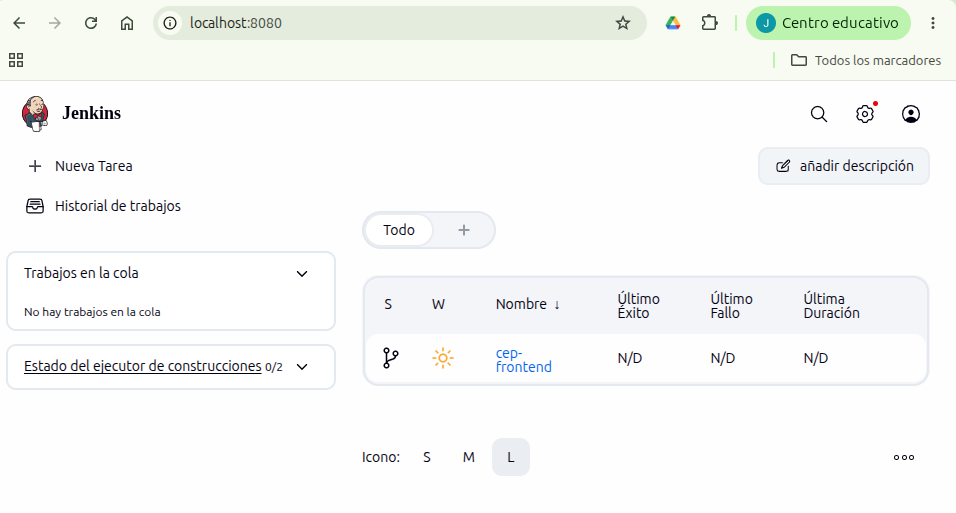

- Plugin HTML Publisher instalado (se usa en la cobertura de código)

    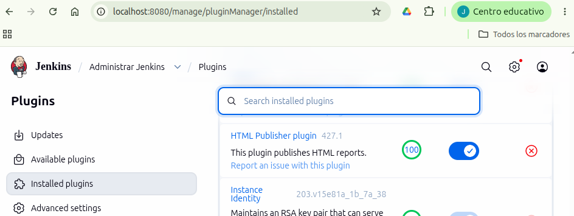

- Repo en GitHub
  
  - Sube el código del proyecto backend
  
    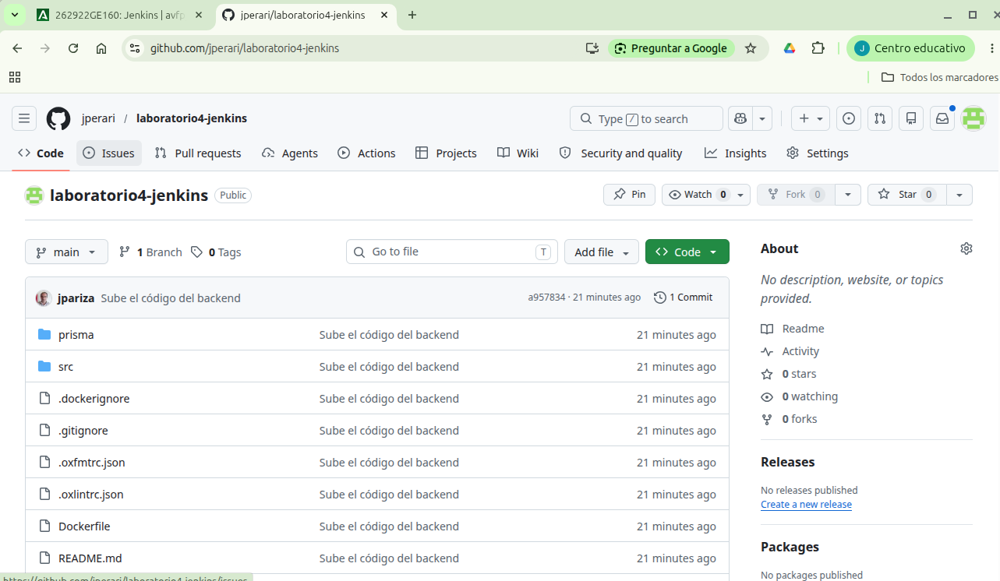
  
  - Sube el código del Jenkinsfile pipeline con pasos obligatorios
  
    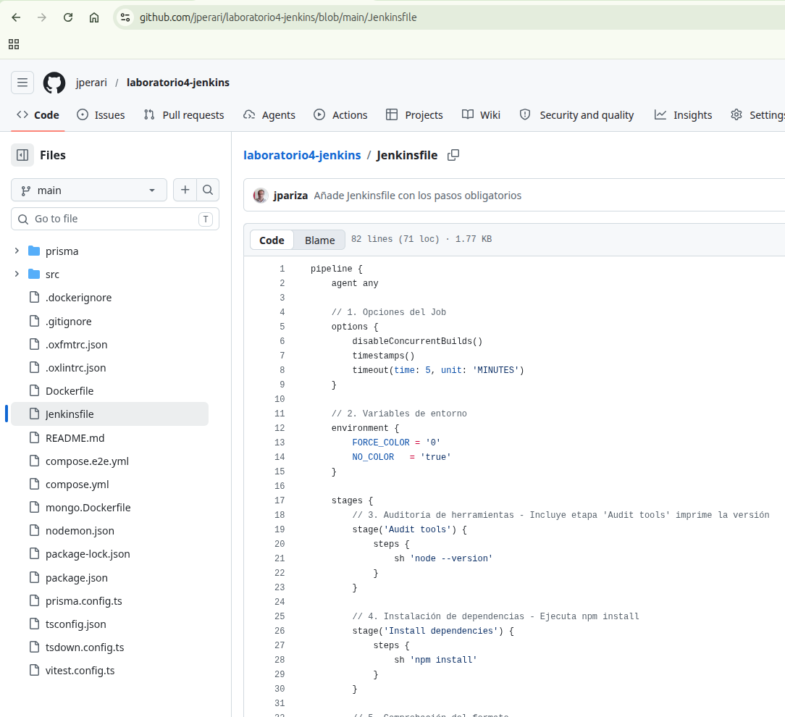
  
  - Token en Github
   
    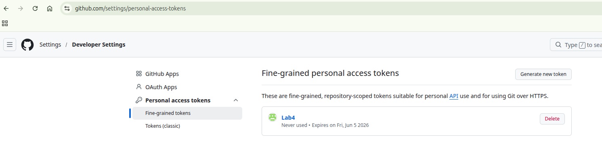

- Jenkins
  
  - Creación del proyecto
    
    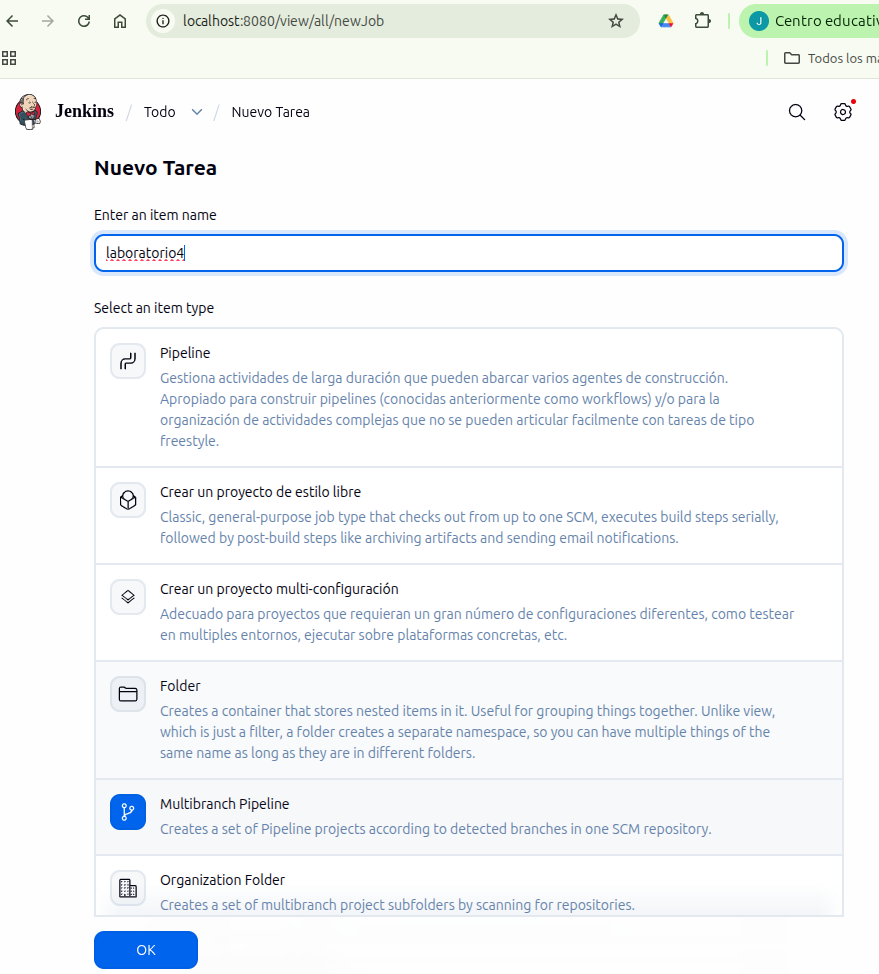
    
  - Configuración del proyecto
    
    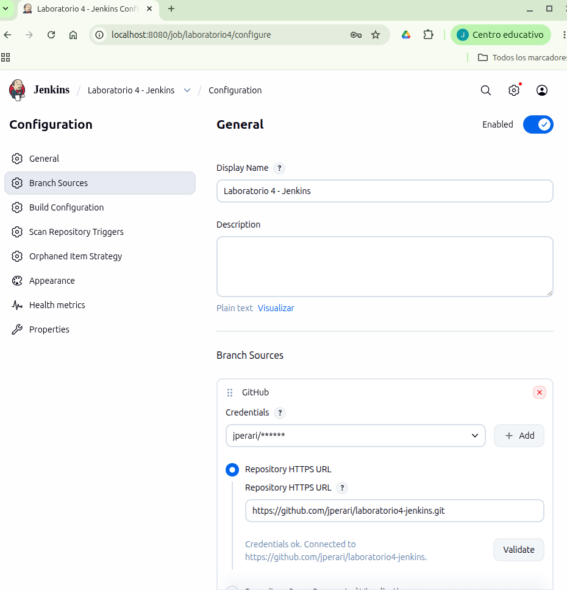
    
  - Escaneo inicial
  
    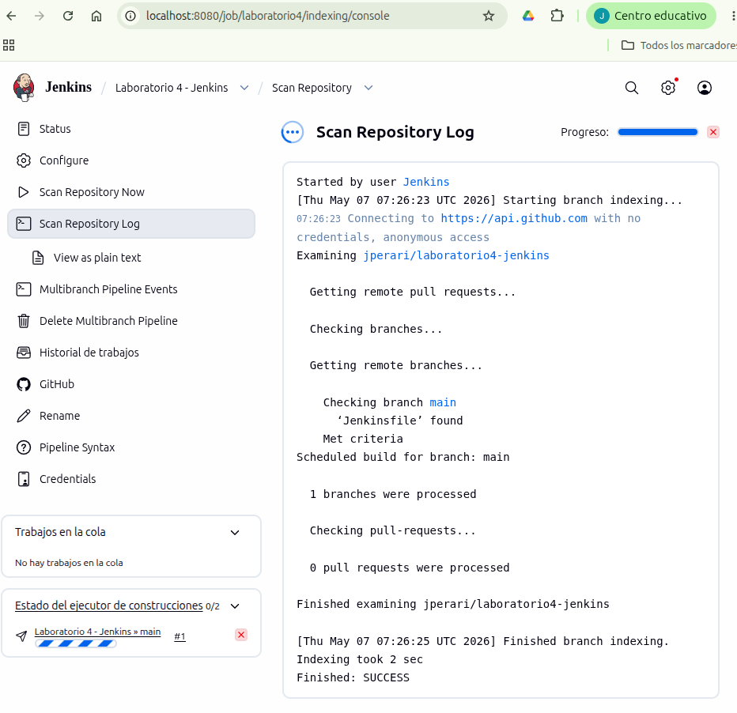
    
  - Ejecución del pipeline con pasos obligatorios
    
    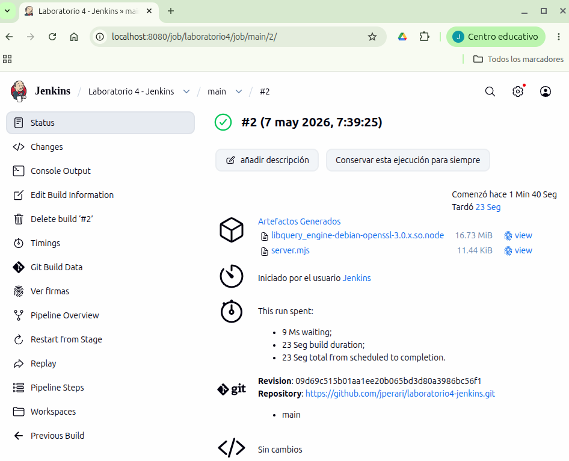
    
  - Ejecución del pipeline con pasos obligatorios (stages)
  
    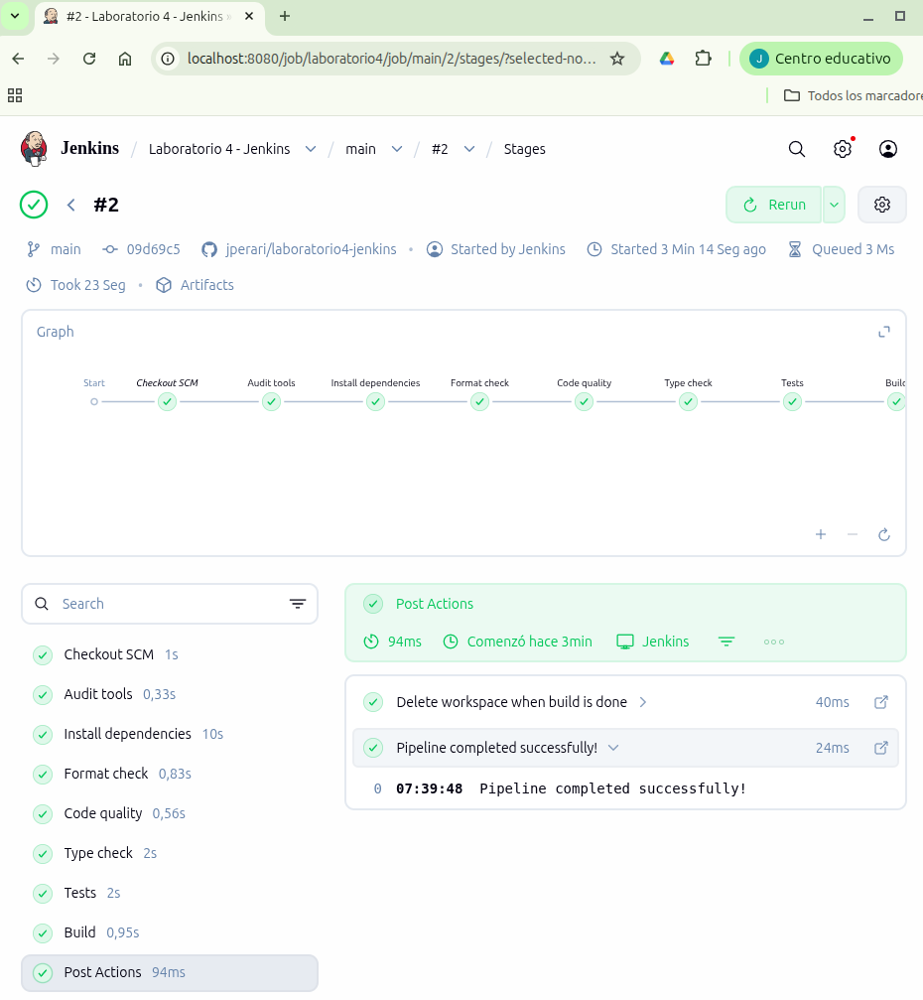
    
  - Ejecución del pipeline con pasos obligatorios (stages con detalle)
    
    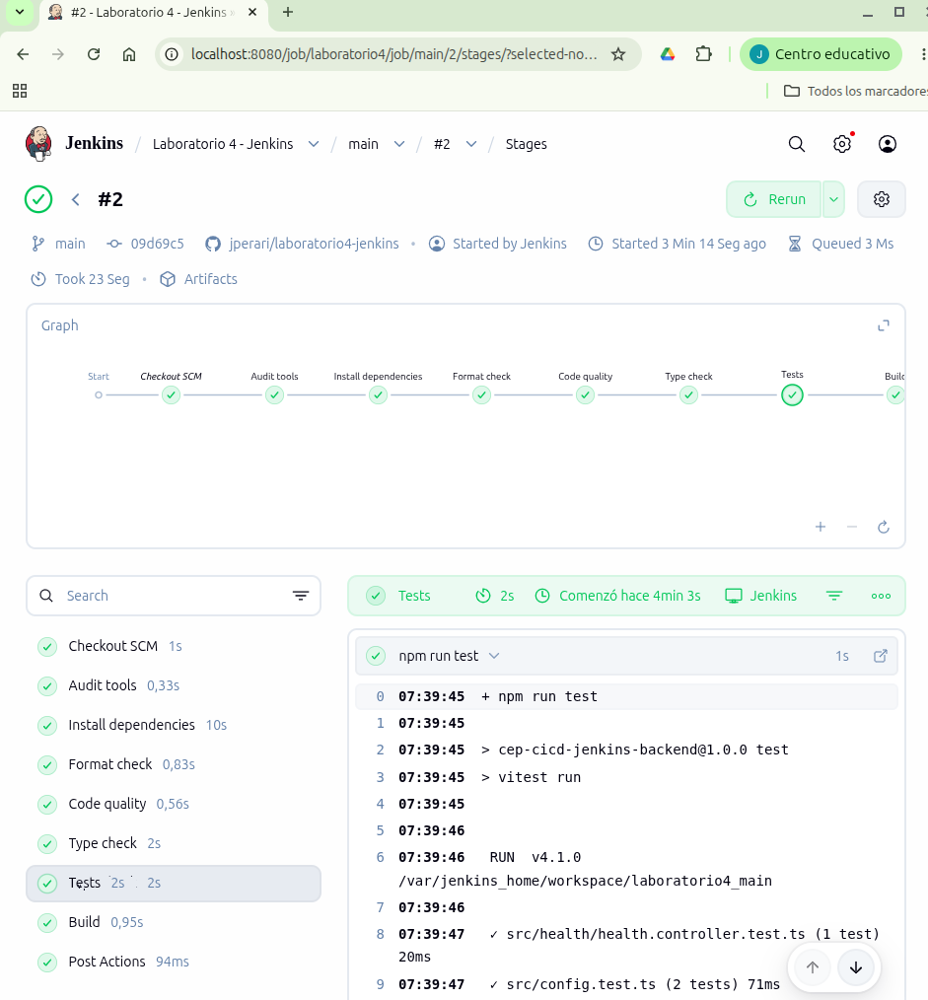
    
  - Aviso de code quality con error pero sin mensaje "inestable"

    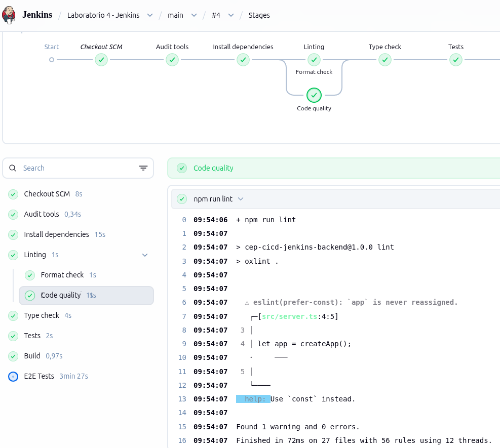
    
  - Ejecución de tareas opcionales salvo la de Docker
  
    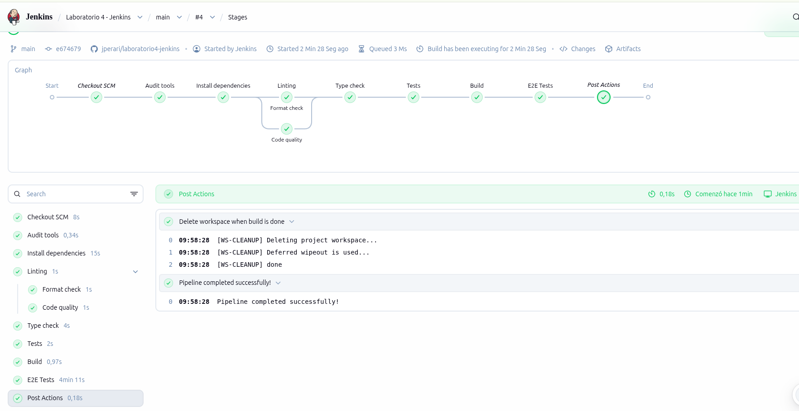
    
  - Informe de cobertura de código

    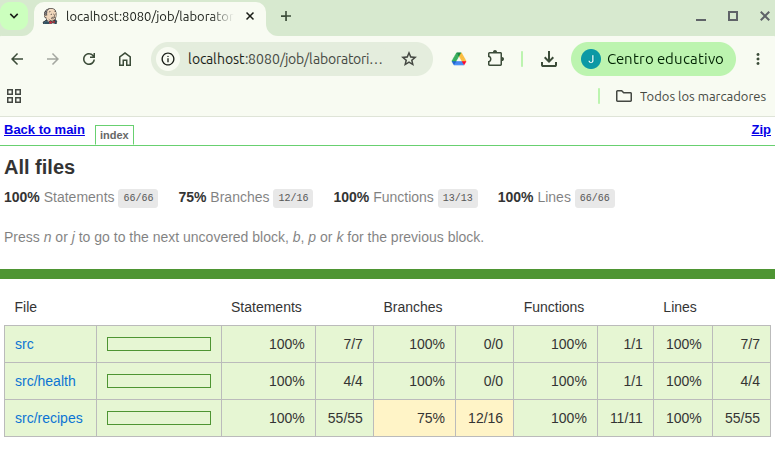
    
  - Jenkins en estado inestable
  
    No salía por defecto, he tenido que añadir esto: `-- --max-warnings=0` en el `sh` del paso `Code quality`

    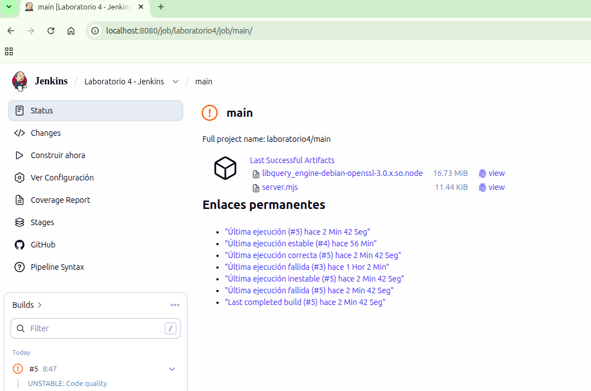
    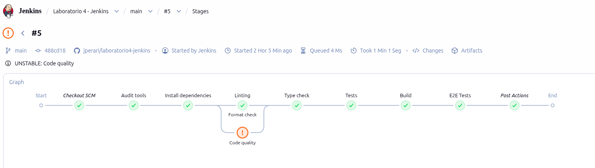

NOTA: Falta la actividad opcional de Docker, si saco un rato la miraré aparte.

